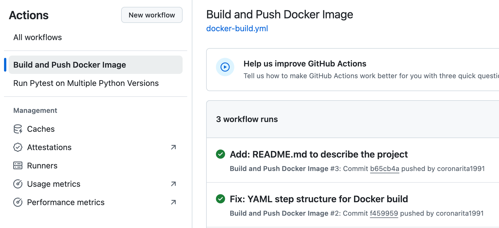
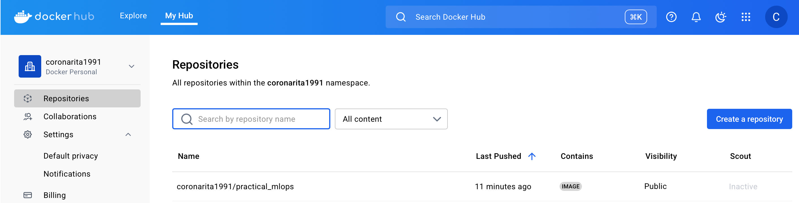
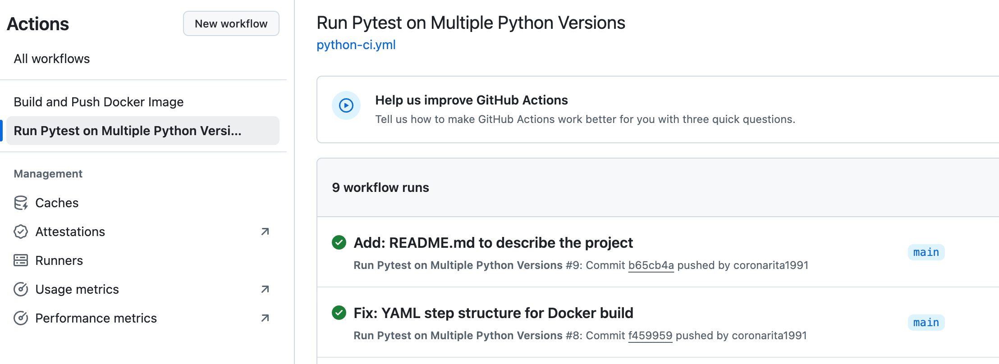

# 🚀 Practical MLOps: CI/CD 기반 머신러닝 실험 환경 구축

[MLOps 실전 가이드](https://books.google.co.kr/books?id=J99CEAAAQBAJ&printsec=copyright&redir_esc=y#v=onepage&q&f=false) 1장을 바탕으로,  
로컬 개발 환경 → 자동 테스트 → Docker 이미지화 → Docker Hub 배포까지  
실제 작동하는 **CI/CD 파이프라인**을 구축한 실습형 프로젝트입니다.

---

## 📁 프로젝트 구조

```bash
.
├── app/                 # 핵심 코드
│   └── main.py
├── tests/               # pytest 기반 테스트
│   └── test_main.py
├── Makefile             # 테스트/포맷 자동화 명령어 정의
├── requirements.txt     # 의존성 관리
├── Dockerfile           # 컨테이너 이미지 정의
├── .dockerignore        # 컨테이너 빌드 제외 대상
└── .github/
    └── workflows/
        ├── docker-build.yml  # GitHub Actions 설정
        └── python-ci.yml     # Python 테스트용 CI
```

---

## 🔧 설치 방법

1. 의존성 설치

```bash
pip install -r requirements.txt
```

2. 로컬 테스트 실행

```bash
make test
```

3. 코드 포맷팅

```bash
make format
```

---

## 📌 사용 기술

- Python 3.10 / 3.11 / 3.12
- pytest
- flake8 / black / isort
- Docker / Docker Hub
- GitHub Actions

---

## 🛤️ 프로젝트 목표

이 프로젝트는 MLOps 실습을 위한 기반 구조를 마련하고,
개발 → 테스트 → 빌드 → 배포의 전 과정을 자동화하는 것이 목적입니다.

향후 FastAPI 서버 구성, Prometheus 기반 모니터링, ML 모델 서빙 구조까지 점차 확장해 나갈 예정입니다.

## 결과
- 도커 빌드, 푸시 워크플로우 수행


- make all 결과
