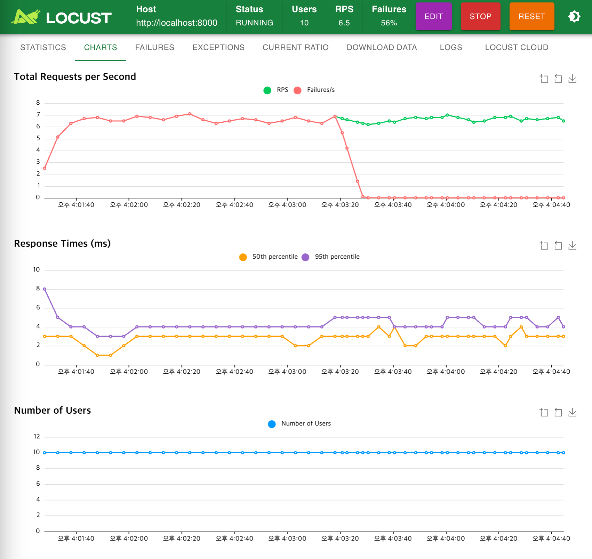

# 🚀 Practical MLOps: CI/CD 기반 머신러닝 실험 환경 구축

[MLOps 실전 가이드](https://books.google.co.kr/books?id=J99CEAAAQBAJ&printsec=copyright&redir_esc=y#v=onepage&q&f=false) 1장을 바탕으로,  
로컬 개발 환경 → 자동 테스트 → Docker 이미지화 → Docker Hub 배포까지  
실제 작동하는 **CI/CD 파이프라인**을 구축한 실습형 프로젝트입니다.

---

## 📁 프로젝트 구조

```bash
.
├── app/                 # 핵심 코드
│   └── main.py
├── tests/               # pytest 기반 테스트
│   └── test_main.py
├── Makefile             # 테스트/포맷 자동화 명령어 정의
├── requirements.txt     # 의존성 관리
├── Dockerfile           # 컨테이너 이미지 정의
├── .dockerignore        # 컨테이너 빌드 제외 대상
└── .github/
    └── workflows/
        ├── docker-build.yml  # GitHub Actions 설정
        └── python-ci.yml     # Python 테스트용 CI
```

---

## 🔧 설치 방법

0. Python 가상환경 설정 (선택적 권장)

```bash
python -m venv .venv
source .venv/bin/activate  # Windows의 경우 .venv\Scripts\activate
```

1. 의존성 설치

```bash
pip install -r requirements.txt
```
- 린터 도구용 pyproject.toml도 함께 설정됩니다.

2. 로컬 테스트 실행

```bash
make test
```

3. 코드 포맷팅

```bash
make format
```
- black/isort/flake8 설정은 pyproject.toml에 포함되어 있습니다.


## 📜 실습 절차

1. `app/main.py`에 간단한 FastAPI API(`/add`) 구현
2. `Makefile` 작성하여 `make format`, `make test` 명령 구성
3. `pyproject.toml`로 `black`, `isort`, `flake8` 등의 린터 설정
4. `python-ci.yml` 설정 → GitHub Actions에서 자동 테스트 수행
5. `Dockerfile` 및 `docker-build.yml` 설정 → 도커 이미지 자동 배포
6. `locustfile.py` 구성 → `/add` API에 대한 부하 테스트 작성
7. `locust` CLI로 부하 테스트 수행 → 결과 이미지 저장
8. README.md 및 블로그에 결과 정리 및 스냅샷 공유

## 🔁 실습 재현 방법

1. FastAPI 서버 실행

```bash
uvicorn app.main:app --reload
```

2. 브라우저 또는 curl로 수동 테스트

```bash
curl "http://localhost:8000/add?x=3&y=5"
# 응답: {"result": 8}
```

3. Locust 부하 테스트 실행

- 웹 UI 모드:

```bash
locust -f locustfile.py --host http://localhost:8000
```

- CLI 모드 (headless):

```bash
locust -f locustfile.py --headless -u 10 -r 2 --host http://localhost:8000
```

## 🧭 현재 구성 요약 및 향후 확장 방향

### ✅ 현재까지 구성된 주요 기능

- FastAPI 기반 `/add` API 구현
- `Makefile` 기반 린팅/테스트 자동화 명령 구성
- `pyproject.toml`을 통한 black, isort, flake8 설정 통합
- GitHub Actions 기반 CI 파이프라인 3종 구성
  - `python-ci.yml`: 모든 브랜치에서 lint/test
  - `docker-build.yml`: main 브랜치 푸시 시 Docker Hub에 자동 배포
  - `locust-ci.yml`: staging 브랜치 푸시 시 자동 부하 테스트
- `locustfile.py` 기반 수동 및 자동 부하 테스트 가능
- 결과 스냅샷 기반 블로그/README 문서화

### 🧩 향후 확장 고려 사항

- 부하 테스트 결과 HTML 리포트 자동 저장 및 업로드
- 간단한 ML 모델 학습/서빙 로직 추가 (예: Scikit-learn)
- Prometheus + Grafana 기반 모니터링 연동
- Staging → Production 환경 분기 자동화 배포 파이프라인 구성
- 테스트 데이터/환경 구성 자동화 (fixtures, faker 등)

---

## 📌 사용 기술

- Python 3.10 / 3.11 / 3.12
- pytest
- flake8 / black / isort
- Docker / Docker Hub
- GitHub Actions

---

## 🛤️ 프로젝트 목표

이 프로젝트는 MLOps 실습을 위한 기반 구조를 마련하고,
개발 → 테스트 → 빌드 → 배포의 전 과정을 자동화하는 것이 목적입니다.

향후 FastAPI 서버 구성, Prometheus 기반 모니터링, ML 모델 서빙 구조까지 점차 확장해 나갈 예정입니다.

## 결과
아래는 GitHub Actions 및 Locust 부하 테스트의 실행 결과입니다. 각각의 워크플로우는 `.github/workflows`에 정의되어 있습니다.
### - 도커 빌드, 푸시 워크플로우 수행


### - locust 부하 테스트 수행 결과 (FastAPI + /add API)
